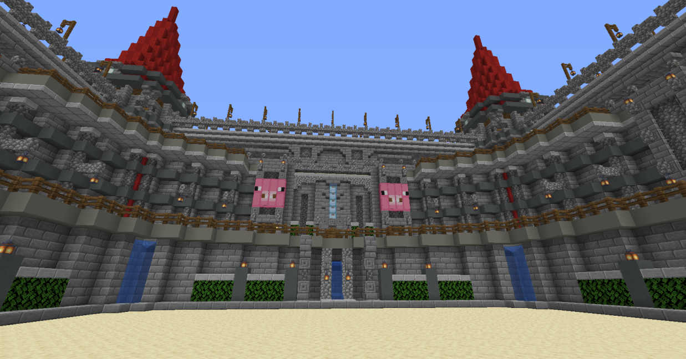
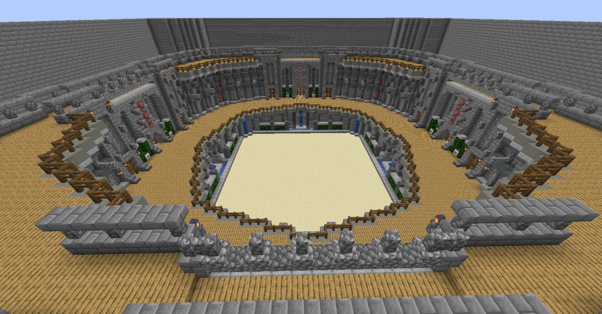

# Build My Thing

# General Idea

**This is based off of a project I started about 2 years prior to finishing... Lots of TODOs and refactoring I may never get to.** Just saying... doesn't reflect how I see code structure these days :)

The general idea behind `Build My Thing` is your classic Pictionary but in Minecraft! The goal is for it to run just as [http://www.skribbl.io](http://www.skribbl.io) does, but instead of drawing you're building.

All issues and potential features can be found on this here repository!

[Word List](BMTWords.md)

## Arena

GolfChampion has already built our arena... but nonetheless it is a circular area with a square/cube region in the center for the builder to build in.

| Main View | Building Area |
| ------ | ------- |
|  |  |


## 📃Sequence of Events

1. A player clicks on a join sign, they will be given speed while in the game
2. Once two players are in a game, a 1 minute timer will start. There will be 5 rounds at 60 seconds each by default
3. If 4 or more players join a game, there will be 3 rounds at 60 seconds each by default
4. There will be a voting GUI prompted with an item in the inventory (perhaps a clock) where players can vote to change the game defaults (see **Game Length and Round Number** below)
5. Go back to the start of the player list. Perhaps an optional feature of shuffling if people want it?
6. Each player will then get one chance per round to build a thing in the cube region and the other players will guess
7. Guessing will be in chat, and if the string contains the guess, they get the proper points and a scoreboard on the side will be updated
8. Point calculations will be performed after each player builds something then tallied up in the end (see **Point Calculations** below)
9. The game will end after the last round has been completed.

**If a player joins halfway through a game,** should we add them to a game? They could simply be added to the roster and be shuffled into the list of players into the next round. They will not be boosted with any points or anything, nor will rounds or game length be adjusted... little incentive for someone to want to join midway through. *This idea stems from the fact that Skribbl does it, but also Skribbl randomly adds people to games, so...*

**If a player leaves halfway through a game,** they will simply be removed from the roster of things being shuffled. They could join back and have the same number of points, though... although it may save some time to just remove them from the game and re-add them or something. Either way, it's possible.

## ⌚Game Length and Round Number

By default, there will be `5 rounds` at `60 seconds` each for 2 or 3 players in a game. When 4 or more join, the default numbers will become `3 rounds` at `60 seconds` each. Players will be able to vote on changing the length. When there are 2 players, all players need to vote on the same changes. If there are greater than 2 players, it needs to be 50% of players voting on one option to change things. Games will max out at 10 players. These changes will be announced / put in place when the game starts, i.e. *3 out of 4 players have voted for the game length to be 120 seconds!*

### Game Length Options

- 60 seconds
- 90 seconds
- 120 seconds
- 150 seconds
- 180 seconds

### Round Numbers

Anywhere between 3 and 10 rounds will be available to be voted on

## 📈Point Calculations

Players can earn points in two ways: by saying the correct answer to what is being built, or by being the builder and getting a multitude of correct answers. We did some research on other servers and how they calculated points which you can find on the below linked page

[Other Server Research](OtherServerResearch.md)

### Timing and Point Awarding "Algorithm"

We will start with saying there are `S` seconds in a round and `P` players in said round. Points will work to be in the upper tens, such that getting a hundred points would be miraculous. These times will definitely need to be adjusted, right now they are all the same but I would love to add conditionals based on the start time, i.e. fourth guess equation changes depending on whether the game started with `120 seconds` or `30 seconds`.

These are all tentative starting equations...

**First guess:** Artist gets `+8`, guesser gets `+10`

- ⏰ **Time Adjustment:** S = S - (1/4)S

**Second guess:** Artist gets `+0`, guesser gets `+8`

- ⏰ **Time Adjustment:** S = S - (1/8)S

**Third guess:** Artist gets `+0`, guesser gets `+5`

- ⏰ **Time Adjustment:** S = S - (1/8)S

**Fourth guess:** Artist gets `+0`, guesser gets `+2`.

- ⏰ **Time Adjustment:** S = (1/2)

**Every subsequent guess:** The artist gets `+0` and the guesser gets `+1`.

- ⏰ **Time Adjustment**
```java
if (S >= 10) {
    S = 10
}
```
  
This is only for the fifth guess, we won't keep resetting haha. Perhaps an idea in the future will be to see if there are still half the players remaining or something.

If all players in a game, where `P > 4`*,* the artist will get a bonus of `+3`. This ends up giving the artist a 2 point advantage if all players guess and a 2 point *dis*advantage if only a few players guess, where the advantage/disadvantage is compared to the first guesser.

**Last second guess:** If a player guesses the word within the last `1.5 seconds` of the game, they get `+3` for a 4 point total *if they are the fourth guesser or greater.*

**All plays guess:** If all players successfully guess the word, the artist gets `+6`
## 👷‍♂️Builders and Guessers

Each round, a player will have one opportunity to be a builder and the rest will be guessers. This goes for each player until the round is over and resets. The sequence is as follows:

1. A builder is chosen to build in the order of players
2. 3 words are chosen, at random, from a list. A player chooses one of the words from a presented inventory UI and has 10 seconds to choose, otherwise one is chosen randomly
3. The timer starts and the player is left to build, restricted within the building region
4. The hints show up above the hot bar and letters are filled in at predetermined time intervals
5. For the first 5 seconds, prevent guesses

   `Please wait 5 seconds before guessing so the artist has a chance to draw! This is to help prevent teaming.`

6. Players guess and points are awarded based on the above 📈`Point Calculations`
7. When the timer runs out (it will be set to 0 if everyone gets the answer correct) choose the next artist

## 💯Scoreboard Format

1. Title of game
2. Drawing #/X - Round #/Y [X is players, Y is total rounds]
3. **Players**
4. Then a list of all players with current artist at the top and some emote next to them to indicate it, possibly a different color than the rest

## Contributing

If you're curious about contributing, feel free to reach out to me on Twitter `@Mobkinz78` or join the [Oinkcraft Discord](http://discord.gg/jXzxWbC) if you wanna say hi!